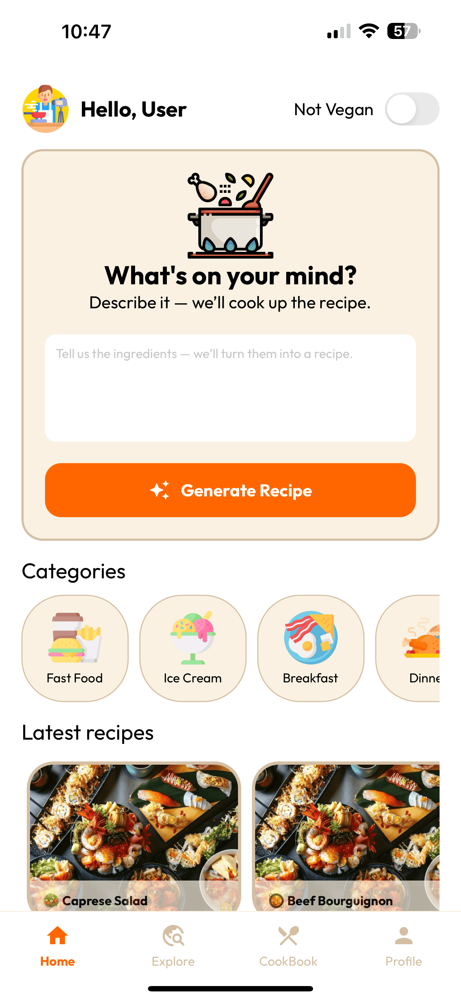
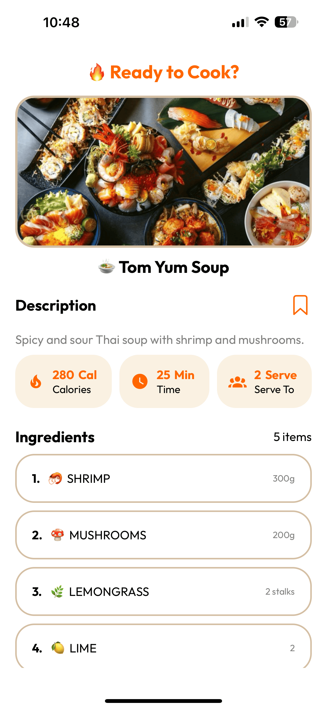
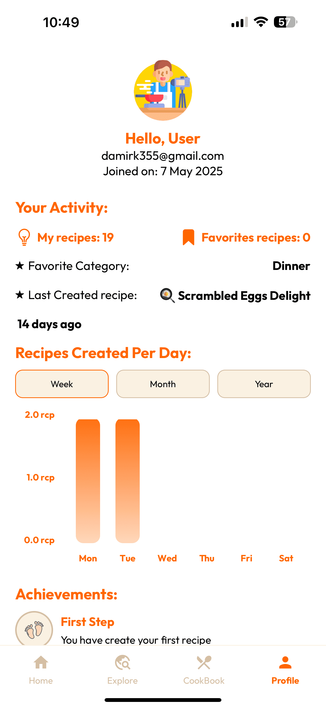

# 🍳 Smart Cook AI

**Smart Cook AI** is an intelligent recipe management app that combines culinary creativity with the power of AI. Designed for food lovers and smart home cooks, it offers a modern experience for generating, saving, and exploring recipes with ease and style.

---

## 🎥 Live Demo

[▶️ Watch Demo Video](./demo/live-demo.mp4)

Click the link above to see the app in action.

---

## 🖼️ Screenshots

👉 [See All Screenshots](./demo/)

<table>
  <tr>
    <td align="center">
       
      <strong>🏠 Home Screen</strong>
    </td>
    <td align="center">
       
      <strong>📖 Recipes Screen</strong>
    </td>
    <td align="center">
       
      <strong>👤 Profile Screen</strong>
    </td>
  </tr>
</table>

---

## 🚀 Tech Stack

### 📱 Client – React Native (Expo)

- **Framework:** React Native (Expo + Expo Router)
- **Navigation:** React Navigation
- **UI Libraries:**
  - Expo Vector Icons
  - React Native Actions Sheet
  - React Native SVG + Chart Kit
- **State & Storage:** React Context, AsyncStorage, Expo Secure Store
- **Forms & Utilities:** Date-fns, React Native WebView
- **Animations & UX:** React Native Reanimated, Expo Haptics, Expo Blur
- **AI Integration:** OpenAI SDK
- **Styling & Tooling:** Prettier, ESlint, TypeScript

### 🔧 Server – Strapi (Node.js + TypeScript)

- **Framework:** Strapi v5 (Headless CMS)
- **Database:** PostgreSQL
- **ORM:** Strapi ORM with Better-SQLite3 for local development
- **Auth & Permissions:** Strapi Users & Permissions plugin
- **Media:** Cloudinary Provider for uploads
- **Deployment:** Strapi CLI + Custom scripts
- **Frontend Utilities:** React + Styled-components (Strapi Admin Customization)

---

> **Smart Cook AI** — where artificial intelligence meets everyday cooking. Fast, smart, and delicious.
