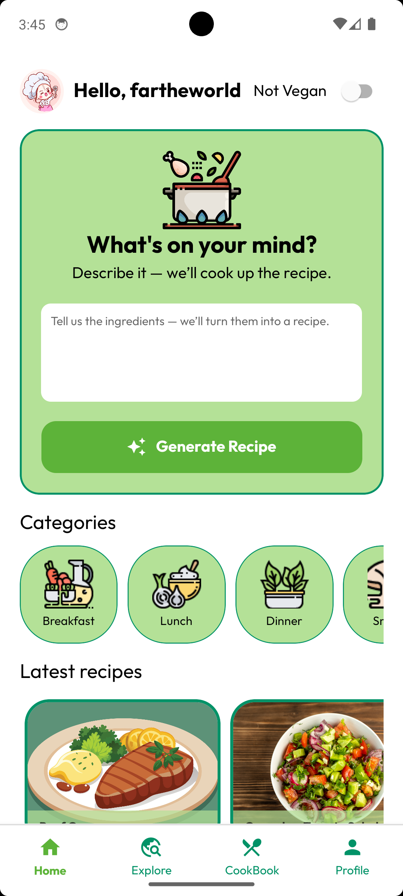

# 🍲 Samayal Mandhiram AI

**An AI-powered cooking assistant that helps you discover delicious recipes, manage your kitchen efficiently, and make smarter food decisions.**

---

## 🧠 About the App

**Samayal Mandhiram AI** is a smart cooking companion built with modern technologies to elevate your culinary experience. Whether you’re a home cook or a kitchen newbie, this app helps you:

- 🔍 Discover AI-recommended recipes
- 📦 Manage ingredients and pantry items
- 📸 Upload and browse recipe images
- 📊 Access nutritional info and cooking tips

---

## ⚙️ Tech Stack

### 🖥️ Frontend (Mobile App)
- **React Native with Expo**
- **Expo Router** for file-based routing
- **Cloudinary** for image/media uploads
- **Metro** for web bundling
- **Typed Routes** for safer navigation

### 🗂️ Backend
- **Strapi CMS** for API and content management
- **Cloudinary Plugin** integrated with Strapi for managing media assets

---

## 📱 App Configuration (Expo)

```json
{
  "name": "Samayal Mandhiram AI",
  "slug": "samayal-mandhiram-ai",
  "description": "An AI-powered cooking assistant that helps you find recipes and manage your kitchen.",
  "version": "1.0.0",
  "orientation": "portrait",
  "icon": "./assets/images/mylogo.png",
  "scheme": "smartcookai",
  "userInterfaceStyle": "automatic",
  "splash": {
    "image": "./assets/images/mylogo.png",
    "resizeMode": "native",
    "backgroundColor": "#ffffff"
  },
  "ios": {
    "supportsTablet": true
  },
  "android": {
    "adaptiveIcon": {
      "foregroundImage": "./assets/images/mylogo.png",
      "backgroundColor": "#ffffff"
    },
    "edgeToEdgeEnabled": true
  },
  "web": {
    "bundler": "metro",
    "output": "static",
    "favicon": "./assets/images/mylogo.png"
  },
  "plugins": [
    "expo-router"
  ],
  "experiments": {
    "typedRoutes": true
  }
}
```

---

## 🛠️ Setup Instructions

### Backend (Strapi CMS)
1. Clone your Strapi backend repo or initialize a new project:
   ```bash
   npx create-strapi-app backend --quickstart
   ```
2. Install Cloudinary upload plugin:
   ```bash
   npm install strapi-provider-upload-cloudinary
   ```
3. Configure the `config/plugins.js` file:
   ```js
   module.exports = {
     upload: {
       config: {
         provider: 'cloudinary',
         providerOptions: {
           cloud_name: 'your-cloud-name',
           api_key: 'your-api-key',
           api_secret: 'your-api-secret',
         },
       },
     },
   };
   ```
4. Create your content types (e.g., Recipes, Ingredients).
5. Deploy to your preferred platform (Render, Railway, Heroku, etc.).

### Frontend (Expo App)
1. Clone this repository:
   ```bash
   git clone https://github.com/yourusername/samayal-mandhiram-ai.git
   cd samayal-mandhiram-ai
   ```
2. Install dependencies:
   ```bash
   npm install
   ```
3. Start the Expo development server:
   ```bash
   npx expo start
   ```
4. Ensure the app is connected to the correct API base URL (Strapi backend).

---

## 🌐 Cloudinary Setup

In your Strapi backend project, make sure the plugin configuration is correctly set in `config/plugins.js`. You’ll need your:

- `cloud_name`
- `api_key`
- `api_secret`

You can get these from your [Cloudinary dashboard](https://cloudinary.com/console).

---

## 📸 Screenshots

---

## 🤝 Contributing

Feel free to fork this repository, open issues, and submit pull requests. Contributions are always welcome!

---

## 📃 License

This project is licensed under the MIT License. See the [LICENSE](LICENSE) file for details.

---

## 📬 Contact

Created with ❤️ by **[Viswanathan P]**  
📧 Email: `drummerviswa@gmail.com`
